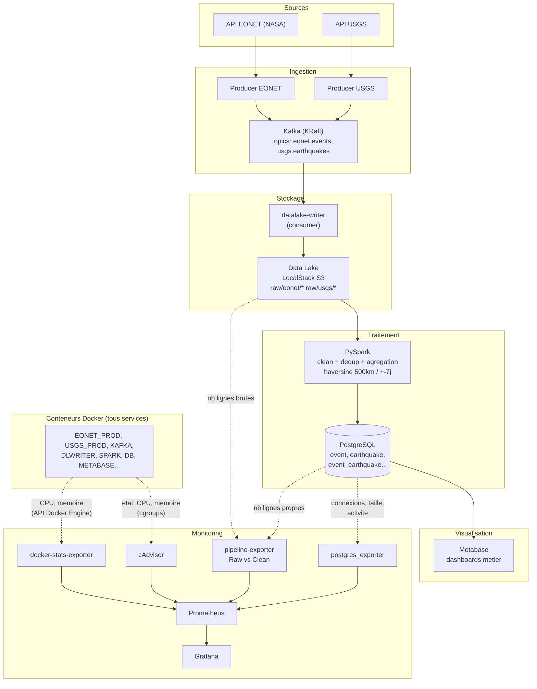

# TP1 & TP2 — Audit, cartographie et pipeline data

Plateforme data reproductible autour de deux sources d'événements naturels :

- **EONET** (NASA Earth Observatory Natural Event Tracker) — API temps réel des events (tempêtes, feux, volcans, icebergs…)
- **USGS** (US Geological Survey) — catalogue mondial des séismes

Chaîne complète, collecte → visualisation, supervisée de bout en bout :

```
API EONET  ─► Producer ─► Kafka ─┐
                                 ├─► Consumer ─► Data Lake (S3) ─► PySpark ─► PostgreSQL ─► Metabase
API USGS   ─► Producer ─► Kafka ─┘

Monitoring : cAdvisor / docker-stats-exporter / postgres_exporter / pipeline-exporter ─► Prometheus ─► Grafana
```

## Pré-requis

- Docker Desktop (ou OrbStack) avec `docker compose`
- ~5 Go de RAM libre
- Ports libres : `3000`, `3001`, `4566`, `5050`, `5432`, `8080`, `8081`, `9090`, `9092`, `9105`, `9106`, `9187`

## Quick start

```bash
# 1. Cloner
git clone https://github.com/flotttt/TP1-Audit-cartographie-des-donn-es.git
cd TP1-Audit-cartographie-des-donn-es

# 2. Config
cp .env.example .env
# (les valeurs par défaut fonctionnent en local)

# 3. Lancer toute la stack
./start.sh
# ou : docker compose up -d --build
```

Le premier boot prend **3 à 5 minutes** (téléchargement d'images + build des services Python + initialisation Kafka/Metabase).

À la fin :
- **Metabase** est déjà configuré (connexion PostgreSQL + 12 questions + dashboard "TP2 EONET vs USGS")
- **Grafana** est déjà configuré (datasource Prometheus + dashboard "TP2 - Infra, Postgres, Pipeline")

## Accès aux services

| Service | URL | Login |
|---|---|---|
| **Metabase** (dashboards data métier) | http://localhost:3000 | `admin@tp.com` / `admin1234` |
| **Grafana** (monitoring infra/pipeline) | http://localhost:3001 | `admin` / `change-me` (voir `.env`) |
| **Prometheus** (métriques brutes) | http://localhost:9090 | — |
| **cAdvisor** (UI native conteneurs) | http://localhost:8081 | — |
| **Kafka UI** | http://localhost:8080 | — |
| **pgAdmin** | http://localhost:5050 | `admin@eonet.com` / `admin` |
| **LocalStack S3** (API only) | http://localhost:4566 | `minio` / `minio12345` |
| **PostgreSQL** | `localhost:5432` | `eonet` / `eonet` |

### Ajouter la base dans pgAdmin

1. Login sur http://localhost:5050
2. Add New Server → Name : `tp`
3. Connection : Host = `db`, User = `eonet`, Password = `eonet`

### Inspecter le Data Lake S3

```bash
docker exec tp-minio awslocal s3 ls s3://raw/ --recursive --human-readable
docker exec tp-minio awslocal s3 cp s3://raw/eonet/... -   # dump d'un fichier
```

## Architecture



## Structure du repo

```
.
├── docker-compose.yml       # orchestration des services
├── .env / .env.example      # variables d'environnement
├── start.sh                 # lanceur pratique
│
├── TP1/                     # audit, modélisation, seed initial
│   ├── worker/              # worker EONET → Postgres (version TP1)
│   ├── sql/                 # schéma cible + seed
│   ├── docs/                # dictionnaire, MCD, MLD
│   └── ...
│
└── TP2/
    ├── TP2-PLAN.md          # plan de travail
    ├── api/                 # producer Kafka EONET
    ├── source2/             # producer Kafka USGS
    ├── datalake/            # consumer Kafka → S3
    ├── spark/               # job PySpark clean + agrégation
    ├── postgres/            # init.sql (schéma cible)
    ├── metabase-init/       # auto-provisioning dashboards Metabase
    ├── monitoring/
    │   ├── prometheus/                  # prometheus.yml (scrape config)
    │   ├── pipeline-exporter/           # exporter custom Raw vs Clean
    │   ├── docker-stats-exporter/       # exporter CPU/mémoire par conteneur (API Docker)
    │   └── grafana/provisioning/        # datasource + dashboard auto-provisionnés
    └── docs/                # doc TP2 (sources, dico, MCD, MLD)
```

## Étapes du pipeline en détail

| # | Service | Rôle |
|---|---|---|
| 1 | `tp-eonet-producer` | Toutes les 15 min : fetch EONET → publie sur topic Kafka `eonet.events` |
| 2 | `tp-usgs-producer` | Toutes les 15 min : fetch USGS → publie sur topic `usgs.earthquakes` |
| 3 | `tp-kafka` | Broker Kafka (mode KRaft, mono-broker) |
| 4 | `tp-datalake-writer` | Consumer : batch les messages → écrit des fichiers `.jsonl` dans S3 (`raw/eonet/`, `raw/usgs/`) partitionnés Hive-style (`year=/month=/day=/hour=/`) |
| 5 | `tp-minio` | LocalStack S3 → sert de Data Lake |
| 6 | `tp-spark` | Toutes les 15 min : lit tout le Data Lake, nettoie (types/dedup/contraintes), agrège via haversine (rayon 500 km, fenêtre ±7 jours), écrit en PostgreSQL via JDBC |
| 7 | `tp-db` | PostgreSQL (schéma TP1 + tables `earthquake` et `event_earthquake`) |
| 8 | `tp-metabase` | UI Data Viz métier — dashboards pré-provisionnés par `tp-metabase-init` |
| 9 | `tp-cadvisor` | Collecte l'état des conteneurs (limité sous ce driver cgroup, voir note ci-dessous) |
| 10 | `tp-docker-stats-exporter` | CPU/mémoire par conteneur via l'API Docker Engine (fiable, indépendant du driver cgroup) |
| 11 | `tp-postgres-exporter` | Métriques PostgreSQL (connexions, taille base, activité) |
| 12 | `tp-pipeline-exporter` | Compte les lignes brutes (Data Lake) vs propres (PostgreSQL) par source, expose l'indicateur Raw vs Clean |
| 13 | `tp-prometheus` | Centralise toutes les métriques (scrape 15s) |
| 14 | `tp-grafana` | Dashboards infra + Postgres + pipeline, provisionnés automatiquement |

**Note monitoring** : `cAdvisor` collecte correctement au démarrage mais, sous certaines configurations de driver cgroup (systemd + cgroup v2 sur WSL2), n'expose pas toujours les métriques CPU/mémoire par conteneur individuel — comportement documenté côté cAdvisor, non résolu par les options standard (`privileged`, `--docker_only`). Le CPU/mémoire par conteneur est donc assuré par `docker-stats-exporter`, qui interroge directement l'API Docker Engine (même mécanisme que `docker stats`) et fonctionne indépendamment du driver cgroup.

## Commandes utiles

```bash
# Voir l'état de la stack
docker compose ps

# Suivre les logs d'un service
docker compose logs -f spark
docker compose logs -f datalake-writer
docker compose logs -f pipeline-exporter

# Forcer un run Spark maintenant (sans attendre l'intervalle)
docker compose restart spark

# Compter les lignes en base
docker exec tp-db psql -U eonet -d eonet -c "
  SELECT 'event' AS t, count(*) FROM event
  UNION ALL SELECT 'earthquake', count(*) FROM earthquake
  UNION ALL SELECT 'event_earthquake', count(*) FROM event_earthquake;"

# Voir les objets du Data Lake
docker exec tp-minio awslocal s3 ls s3://raw/ --recursive --human-readable

# Voir les topics Kafka + offsets
docker exec tp-kafka /opt/kafka/bin/kafka-topics.sh --bootstrap-server localhost:9092 --list
docker exec tp-kafka /opt/kafka/bin/kafka-get-offsets.sh --bootstrap-server localhost:9092 --topic eonet.events

# Recharger la config Prometheus après une modif de prometheus.yml
docker compose restart prometheus

# Reset complet (destructif : perd toutes les données)
docker compose down -v
```

## Réinitialiser uniquement Metabase

```bash
docker compose stop metabase metabase-init
docker compose rm -f metabase metabase-init
docker volume rm tp_metabase-data
docker compose up -d metabase metabase-init
```

Le service `metabase-init` détecte automatiquement une base vierge et rejoue le setup complet + les 12 questions + le dashboard.

## Réinitialiser uniquement Grafana

```bash
docker compose stop grafana
docker compose rm -f grafana
docker volume rm tp_grafana-data
docker compose up -d grafana
```

Datasource et dashboard sont re-provisionnés automatiquement au démarrage (fichiers dans `TP2/monitoring/grafana/provisioning/`).

## Variables d'environnement principales

Voir `.env.example`. Les plus utiles :

| Variable | Rôle | Défaut |
|---|---|---|
| `EONET_LIMIT`, `EONET_DAYS` | Nb events / fenêtre EONET | 50 / 30j |
| `USGS_MIN_MAGNITUDE`, `USGS_DAYS`, `USGS_LIMIT` | Filtres USGS | 4.5 / 30j / 500 |
| `WORKER_INTERVAL_SECONDS` | Cadence des producers | 900 (15 min) |
| `SPARK_INTERVAL_SECONDS` | Cadence du job Spark | 900 (15 min) |
| `AGGREGATION_MAX_KM`, `AGGREGATION_MAX_HOURS` | Fenêtre agrégation event ↔ séisme | 500 km / 168h |
| `BATCH_MAX_MESSAGES`, `BATCH_MAX_SECONDS` | Flush du consumer S3 | 200 / 30s |
| `GRAFANA_ADMIN_USER`, `GRAFANA_ADMIN_PASSWORD` | Login Grafana | admin / change-me |

## Limites connues

- **cAdvisor** ne descend pas au niveau conteneur individuel sous certains drivers cgroup (voir note dans le tableau du pipeline) — contourné par `docker-stats-exporter`.
- Les producers EONET et USGS re-fetchent l'intégralité de leur fenêtre temporelle à chaque cycle (pas de collecte incrémentale) : le Data Lake accumule volontairement des doublons, dédoublonnés ensuite par Spark. C'est visible sur le dashboard Grafana via l'écart entre les courbes "raw" et "clean" du panel Raw vs Clean — un comportement attendu, pas une anomalie.
