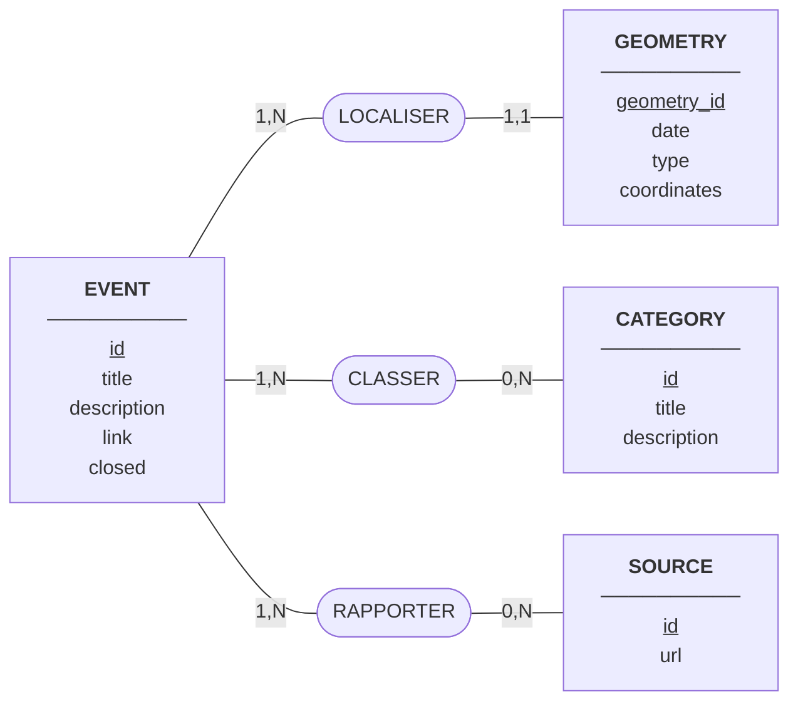

### Modèle conceptuel (MCD)

```mermaid
flowchart LR
    EVENT["<b>EVENT</b><br/>──────────<br/><u>id</u><br/>title<br/>description<br/>link<br/>closed"]
    GEOMETRY["<b>GEOMETRY</b><br/>──────────<br/><u>geometry_id</u><br/>date<br/>type<br/>coordinates"]
    CATEGORY["<b>CATEGORY</b><br/>──────────<br/><u>id</u><br/>title<br/>description"]
    SOURCE["<b>SOURCE</b><br/>──────────<br/><u>id</u><br/>url"]
 
    LOC(["LOCALISER"])
    CLA(["CLASSER"])
    RAP(["RAPPORTER"])
 
    EVENT ---|"1,N"| LOC ---|"1,1"| GEOMETRY
    EVENT ---|"1,N"| CLA ---|"0,N"| CATEGORY
    EVENT ---|"1,N"| RAP ---|"0,N"| SOURCE
```
