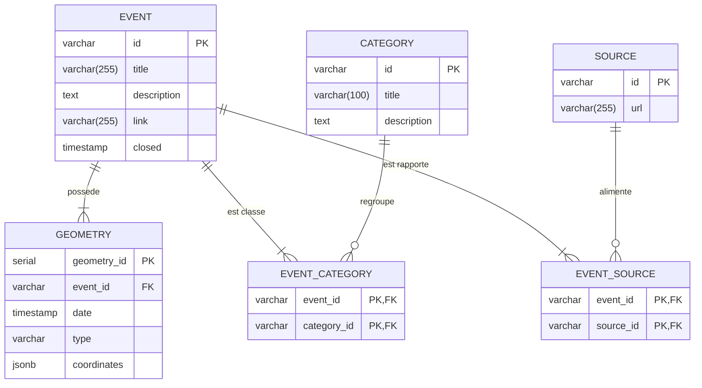

### Modèle logique (MLD)

```mermaid
erDiagram
    EVENT ||--|{ GEOMETRY : "possede"
    EVENT ||--|{ EVENT_CATEGORY : "est classe"
    CATEGORY ||--o{ EVENT_CATEGORY : "regroupe"
    EVENT ||--|{ EVENT_SOURCE : "est rapporte"
    SOURCE ||--o{ EVENT_SOURCE : "alimente"
 
    EVENT {
        varchar id PK
        varchar(255) title
        text description
        varchar(255) link
        timestamp closed
    }
    CATEGORY {
        varchar id PK
        varchar(100) title
        text description
    }
    SOURCE {
        varchar id PK
        varchar(255) url
    }
    GEOMETRY {
        serial geometry_id PK
        varchar event_id FK
        timestamp date
        varchar type
        jsonb coordinates
    }
    EVENT_CATEGORY {
        varchar event_id PK, FK
        varchar category_id PK, FK
    }
    EVENT_SOURCE {
        varchar event_id PK, FK
        varchar source_id PK, FK
    }
```
