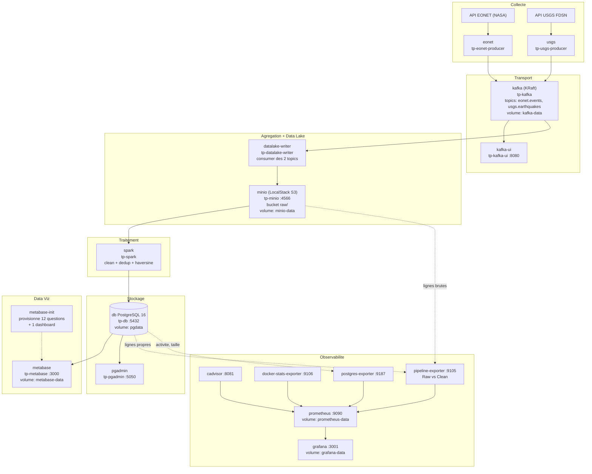

# TP2 Pipeline data temps réel & plateforme data : EONET + USGS

Suite du TP1. Le TP1 cartographiait et modélisait une source unique (API EONET de la NASA). Le TP2 transforme cette architecture en une **plateforme data automatisée et observable** : deux sources collectées en continu, transportées par Kafka, stockées brutes dans un Data Lake, nettoyées et agrégées par PySpark, chargées dans PostgreSQL, exposées dans Metabase, et supervisées par Prometheus et Grafana.

Le tout démarre avec une seule commande depuis la racine du dépôt.

---

## Sommaire des livrables

| # | Livrable attendu | Où |
|---|------------------|----|
| 1 | Présentation du sujet | [`docs/01-presentation.md`](docs/01-presentation.md) |
| 2 | Description des deux sources et de leur lien métier | [`docs/02-sources.md`](docs/02-sources.md) |
| 3 | Dictionnaire de données (EONET + USGS + rapprochement) | [`docs/03-dictionnaire.md`](docs/03-dictionnaire.md) |
| 4 | Entités, attributs, relations et cardinalités | [`docs/04-entites-relations.md`](docs/04-entites-relations.md) |
| 5 | Modèle conceptuel (MCD) | [`docs/05-mcd.md`](docs/05-mcd.md) |
| 6 | Modèle logique (MLD) | [`docs/06-mld.md`](docs/06-mld.md) |
| 7 | Schéma d'architecture (services et volumes Docker) | [section Architecture](#architecture) de ce fichier |
| 8 | Collecte API + Kafka | [`api/producer.py`](api/producer.py) |
| 9 | Collecte source 2 | [`source2/producer.py`](source2/producer.py) |
| 10 | Agrégation + Data Lake | [`datalake/consumer.py`](datalake/consumer.py) |
| 11 | Traitement PySpark | [`spark/clean_and_load.py`](spark/clean_and_load.py) |
| 12 | Chargement PostgreSQL | [`postgres/init.sql`](postgres/init.sql) |
| 13 | Dashboard Data Viz | [`metabase-init/init.py`](metabase-init/init.py) (12 questions + dashboard auto-provisionnés) |
| 14 | Observabilité (Prometheus, Grafana, Raw vs Clean) | [`monitoring/`](monitoring/) |
| 15 | Orchestration Docker | [`../docker-compose.yml`](../docker-compose.yml) |

---

## Les deux sources

| | Source 1 | Source 2 |
|---|---|---|
| Nom | EONET v3 (NASA Earth Observatory Natural Event Tracker) | USGS Earthquake Catalog (web service FDSN) |
| URL | https://eonet.gsfc.nasa.gov/api/v3 | https://earthquake.usgs.gov/fdsnws/event/1/ |
| Format | JSON imbriqué (listes de catégories, sources, géométries) | GeoJSON FeatureCollection (une feature par séisme) |
| Fraîcheur | Quasi temps réel | Temps réel, feeds rafraîchis chaque minute |
| Collecte | Producer Python en boucle, publication sur Kafka | Producer Python en boucle, publication sur Kafka |
| Rôle | Événements naturels (feux, tempêtes, volcans, glaces...) | Activité sismique mondiale |

**Lien métier** : les deux sources décrivent des événements naturels localisés et datés. Le rapprochement est donc **spatio-temporel** : pour chaque point EONET de type `Point`, on identifie les séismes USGS survenus à moins de `AGGREGATION_MAX_KM` (500 km par défaut) et dans une fenêtre de `AGGREGATION_MAX_HOURS` (168 h, soit plus ou moins 7 jours). Le sens géophysique est fort pour les volcans, dont l'activité s'accompagne souvent d'essaims sismiques.

Détail complet dans [`docs/02-sources.md`](docs/02-sources.md).

---

## Architecture



### Chaîne linéaire

```text
API EONET ─► producer ─► Kafka ─┐
                                ├─► datalake-writer ─► Data Lake S3 ─► PySpark ─► PostgreSQL ─► Metabase
API USGS  ─► producer ─► Kafka ─┘

Monitoring : cAdvisor / docker-stats / postgres_exporter / pipeline-exporter ─► Prometheus ─► Grafana
```

### Volumes de persistance

| Volume | Service | Contenu |
|---|---|---|
| `pgdata` | `db` | Données PostgreSQL (`public.*` et `staging.*`) |
| `kafka-data` | `kafka` | Logs des topics (durabilité des messages) |
| `minio-data` | `minio` | Data Lake S3 (objets `raw/`) |
| `metabase-data` | `metabase` | Base interne H2 (questions, dashboard, utilisateur admin) |
| `prometheus-data` | `prometheus` | Séries temporelles des métriques |
| `grafana-data` | `grafana` | État Grafana (datasource et dashboard restent provisionnés par fichiers) |

---

## Démarrage

Prérequis : Docker et Docker Compose, environ 5 Go de RAM libre, ports `3000`, `3001`, `4566`, `5050`, `5432`, `8080`, `8081`, `9090`, `9092`, `9105`, `9106`, `9187` disponibles.

Toutes les commandes se lancent **depuis la racine du dépôt** (le `docker-compose.yml` y est mutualisé entre TP1, TP2 et TP3).

```bash
# 1. Configuration
cp .env.example .env      # les valeurs par défaut fonctionnent en local

# 2. Tout démarrer
./start.sh
# équivalent : docker compose up -d --build
```

Le premier boot prend **3 à 5 minutes** (téléchargement des images, build des services Python, initialisation de Kafka et de Metabase).

Aucune intervention manuelle n'est nécessaire ensuite : les producers tournent en boucle, le consumer écrit en continu dans le Data Lake, le job Spark se relance toutes les 15 minutes, Metabase et Grafana sont provisionnés automatiquement.

### Accès aux services

| Service | URL | Identifiants |
|---|---|---|
| Metabase (Data Viz métier) | http://localhost:3000 | `admin@tp.com` / `admin1234` |
| Grafana (monitoring) | http://localhost:3001 | `admin` / `change-me` |
| Prometheus | http://localhost:9090 | aucun |
| Kafka UI | http://localhost:8080 | aucun |
| cAdvisor | http://localhost:8081 | aucun |
| pgAdmin | http://localhost:5050 | `admin@eonet.com` / `change-me` |
| LocalStack S3 (API) | http://localhost:4566 | `minio` / `minio12345` |
| PostgreSQL | `localhost:5432` | `eonet` / `change-me` |

### Arrêter

```bash
docker compose down        # conserve les volumes
docker compose down -v     # supprime aussi les données (destructif)
```

---

## Le pipeline étape par étape

### Étape A, collecte

| Service | Fichier | Comportement |
|---|---|---|
| `eonet` | [`api/producer.py`](api/producer.py) | Interroge `/events` (paramètres `status`, `days`, `limit`), publie un message par événement sur le topic `eonet.events`, clé = `event.id`. Producer idempotent, `acks=all`. |
| `usgs` | [`source2/producer.py`](source2/producer.py) | Interroge `/query?format=geojson` (paramètres `starttime`, `endtime`, `minmagnitude`, `limit`, `orderby=time`), publie une feature GeoJSON par message sur `usgs.earthquakes`, clé = `feature.id`. |

Les deux tournent en boucle toutes les `WORKER_INTERVAL_SECONDS` (900 s par défaut).

Vérifier la réception côté Kafka :

```bash
docker exec tp-kafka /opt/kafka/bin/kafka-topics.sh --bootstrap-server localhost:9092 --list
docker exec tp-kafka /opt/kafka/bin/kafka-get-offsets.sh --bootstrap-server localhost:9092 --topic eonet.events
docker exec tp-kafka /opt/kafka/bin/kafka-get-offsets.sh --bootstrap-server localhost:9092 --topic usgs.earthquakes
```

Ou visuellement dans Kafka UI : http://localhost:8080.

### Étape B, agrégation

L'agrégation se fait à deux niveaux, chacun avec une justification métier différente :

1. **Agrégation technique des flux** ([`datalake/consumer.py`](datalake/consumer.py)) : un seul consumer, un seul groupe (`datalake-writer`), abonné aux deux topics. Il réunit les deux sources dans un même Data Lake, avec le même format de fichier et la même convention de partitionnement. Les offsets sont commités manuellement après écriture réussie sur S3, ce qui évite de perdre des messages.

2. **Agrégation métier des données** ([`spark/clean_and_load.py`](spark/clean_and_load.py), fonction `compute_event_earthquake`) : jointure spatio-temporelle entre les points EONET et les séismes USGS.
   - Filtre temporel d'abord : `|event_time - earthquake_time| <= AGGREGATION_MAX_HOURS`.
   - Puis distance haversine (rayon terrestre 6371 km) : `distance_km <= AGGREGATION_MAX_KM`.
   - Résultat écrit dans `event_earthquake` avec les attributs calculés `distance_km` et `delay_hours`.

C'est ce second niveau qui matérialise le lien métier : croiser un risque naturel suivi par la NASA avec l'activité sismique proche.

### Étape C, Data Lake

Solution retenue : **LocalStack S3** (service `minio`, conteneur `tp-minio`). Le choix d'une API S3 plutôt qu'un simple volume disque permet à PySpark de lire via `s3a://` exactement comme sur un Data Lake cloud, sans changer une ligne de code entre local et production.

Les données brutes ne sont jamais transformées avant écriture : un message Kafka = une ligne JSON dans un fichier `.jsonl`, partitionné Hive-style.

```text
s3://raw/
├── eonet/
│   └── year=2026/month=09/day=28/hour=14/
│       └── eonet-20260928T143012Z-1774707012000.jsonl
└── usgs/
    └── year=2026/month=09/day=28/hour=14/
        └── usgs-20260928T143012Z-1774707012000.jsonl
```

Le flush intervient dès que l'une des deux conditions est remplie : `BATCH_MAX_MESSAGES` messages accumulés (200) ou `BATCH_MAX_SECONDS` écoulées (30 s).

Inspecter le Data Lake :

```bash
docker exec tp-minio awslocal s3 ls s3://raw/ --recursive --human-readable
docker exec tp-minio awslocal s3 cp s3://raw/eonet/year=2026/... -   # dump d'un fichier
```

### Étape D, traitement PySpark

[`spark/clean_and_load.py`](spark/clean_and_load.py), relancé toutes les `SPARK_INTERVAL_SECONDS` par [`spark/entrypoint.sh`](spark/entrypoint.sh) via `spark-submit` (packages `hadoop-aws`, `aws-java-sdk-bundle`, driver JDBC PostgreSQL).

| Traitement | Mise en œuvre |
|---|---|
| Contrôle des types | Schémas Spark explicites (`EONET_SCHEMA`, `USGS_SCHEMA`), pas d'inférence. `closed` et `geometry.date` en `to_timestamp`, `properties.time` converti depuis epoch millisecondes, `tsunami` casté en booléen. |
| Valeurs manquantes | Rejet des lignes sans clé métier (`id`, `title`, `link`, `time`, coordonnées). `coalesce` sur `category.title` (fallback sur l'id) et sur `tsunami` (fallback `false`). `explode_outer` pour ne pas perdre les events sans catégorie ou sans source. |
| Doublons | `dropDuplicates(["id"])` sur `event` et `earthquake`, `dropDuplicates(["event_id", "date", "coordinates"])` sur `geometry`, `dropDuplicates()` sur les tables de jonction. Indispensable : les producers re-fetchent toute leur fenêtre à chaque cycle. |
| Normalisation | `trim` des titres, rejet des titres vides, validation des URLs par `rlike("^https?://")`, session Spark en UTC. |
| Validité | Bornes géographiques (`longitude` entre -180 et 180, `latitude` entre -90 et 90), magnitude entre -1 et 10, `geometry.type` restreint à `Point` et `Polygon`. |
| Transformation | Éclatement du JSON imbriqué EONET en tables relationnelles (`explode_outer` sur `categories`, `sources`, `geometry`). Extraction de `longitude`, `latitude`, `depth_km` depuis le tableau `geometry.coordinates` de l'USGS. |
| Enrichissement / agrégation | Calcul haversine et écart temporel, alimentation de `event_earthquake`. |

Le job écrit d'abord les données **brutes** dans le schéma `staging.*` (sans contraintes), puis les données **propres** dans `public.*`. Ce doublement a été ajouté pour le TP3 : il permet de mesurer la qualité avant et après intervention. Le job commence par un `TRUNCATE` des deux schémas, ce qui le rend idempotent : chaque run reconstruit l'état complet depuis le Data Lake.

Forcer un run immédiat :

```bash
docker compose restart spark
docker compose logs -f spark
```

### Étape E, PostgreSQL

Schéma créé au démarrage par [`postgres/init.sql`](postgres/init.sql) (monté en `/docker-entrypoint-initdb.d/01-init.sql`). Il reprend la modélisation du TP1 et l'étend avec la seconde source.

8 tables, conformes au [MLD](docs/06-mld.md) :

```text
event 1 ─── N geometry                    (EONET, suivi dans le temps)
event N ─── N category    via event_category    (EONET)
event N ─── N source      via event_source      (EONET)
event N ─── N earthquake  via event_earthquake  (lien métier EONET x USGS)
```

`event_earthquake` est une table de jonction **porteuse d'attributs** (`distance_km`, `delay_hours`) : ce ne sont pas des données sources mais le résultat du calcul d'agrégation.

Les contraintes reprennent et prolongent celles du TP1 : PK sur chaque entité, PK composites sur les tables de jonction, FK avec `ON DELETE CASCADE` vers `event` et `ON DELETE RESTRICT` vers les référentiels `category` et `source`, `CHECK` de validation des URLs (`^https?://`), validation GeoJSON des coordonnées d'un `Point` (tableau de 2 valeurs, longitude et latitude dans leurs bornes), bornes sur `longitude`, `latitude` et `magnitude` côté séismes, et contrainte d'unicité `(event_id, date, coordinates)` sur les observations. 7 index couvrent les FK et les colonnes de filtrage des dashboards (`event.closed`, `earthquake.time`, `earthquake.magnitude`).

Ces contraintes font double emploi avec le nettoyage PySpark, volontairement : Spark filtre en amont pour ne pas faire échouer le chargement, la base refuse en dernier recours ce qui aurait échappé au filtre.

Compter les lignes chargées :

```bash
docker exec tp-db psql -U eonet -d eonet -c "
  SELECT 'event' AS t, count(*) FROM event
  UNION ALL SELECT 'category', count(*) FROM category
  UNION ALL SELECT 'source', count(*) FROM source
  UNION ALL SELECT 'geometry', count(*) FROM geometry
  UNION ALL SELECT 'earthquake', count(*) FROM earthquake
  UNION ALL SELECT 'event_earthquake', count(*) FROM event_earthquake;"
```

Ajouter la base dans pgAdmin : login sur http://localhost:5050, Add New Server, Host = `db`, User = `eonet`, Password = `change-me`.

### Étape F, Data Visualization

Outil retenu : **Metabase**, connecté à PostgreSQL. Le service `metabase-init` ([`metabase-init/init.py`](metabase-init/init.py)) détecte une instance vierge et rejoue automatiquement le setup complet : création de l'admin, ajout de la datasource PostgreSQL, création de 12 questions SQL et assemblage du dashboard **TP2 EONET vs USGS**.

| Indicateur | Type |
|---|---|
| Total events actifs | scalaire |
| Total séismes | scalaire |
| Magnitude max | scalaire |
| Rapprochements event / séisme | scalaire |
| Events par catégorie | barres |
| Séismes par plage de magnitude | barres |
| Séismes par jour | courbe |
| Carte des séismes (M >= 5) | carte |
| Carte des events EONET | carte |
| Top rapprochements event / séisme | table |
| Distribution distance / délai | nuage de points |
| Séismes avec alerte tsunami | table |

Les quatre premiers indicateurs donnent la vue d'ensemble, les cartes valident visuellement la cohérence géographique, et les trois derniers exploitent spécifiquement le produit de l'agrégation.

Réinitialiser uniquement Metabase :

```bash
docker compose stop metabase metabase-init
docker compose rm -f metabase metabase-init
docker volume rm tp_metabase-data
docker compose up -d metabase metabase-init
```

---

## Observabilité

Quatre exporters alimentent Prometheus ([`monitoring/prometheus/prometheus.yml`](monitoring/prometheus/prometheus.yml), scrape toutes les 15 s), Grafana consomme Prometheus. Datasource et dashboard sont provisionnés par fichiers dans [`monitoring/grafana/provisioning/`](monitoring/grafana/provisioning/) : le dashboard **TP2 - Infra, Postgres, Pipeline** est présent dès le premier démarrage.

| Exporter | Port | Ce qu'il expose |
|---|---|---|
| `cadvisor` | 8081 | État et présence des conteneurs (cgroups) |
| `docker-stats-exporter` ([source](monitoring/docker-stats-exporter/)) | 9106 | CPU et mémoire par conteneur, via l'API Docker Engine |
| `postgres-exporter` | 9187 | Disponibilité, connexions, taille de la base, activité |
| `pipeline-exporter` ([source](monitoring/pipeline-exporter/)) | 9105 | Volumétrie Raw vs Clean |

### Les trois niveaux du dashboard

**Infrastructure** : état des conteneurs, disponibilité des services (via les `up` de Prometheus), CPU et mémoire par conteneur.

**PostgreSQL** : disponibilité, nombre de connexions, taille de la base, activité.

**Pipeline data, indicateur Raw vs Clean** : c'est le cœur de la supervision métier. L'exporter custom compte, à chaque refresh (30 s), les lignes brutes présentes dans le Data Lake et les lignes propres présentes en base :

| Métrique | Labels | Signification |
|---|---|---|
| `pipeline_raw_objects_total` | `source` = `eonet` / `usgs` | Nombre de fichiers `.jsonl` dans le Data Lake |
| `pipeline_raw_lines_total` | `source` = `eonet` / `usgs` | Nombre de lignes JSON brutes collectées |
| `pipeline_clean_rows_total` | `table` = `event` / `earthquake` | Nombre de lignes chargées en PostgreSQL |
| `pipeline_exporter_last_success_timestamp` | aucun | Horodatage du dernier refresh réussi |
| `pipeline_exporter_errors_total` | aucun | Compteur d'échecs de refresh |

Comparer `pipeline_raw_lines_total` et `pipeline_clean_rows_total` permet de vérifier d'un coup d'œil que les données collectées sont effectivement traitées et chargées. L'écart entre les deux courbes est **normal et attendu** : les producers re-fetchent l'intégralité de leur fenêtre à chaque cycle, donc le Data Lake accumule volontairement des doublons que Spark dédoublonne ensuite. Un raw qui monte pendant qu'un clean reste plat pendant plus de 15 minutes, en revanche, signale un job Spark en échec.

Vérifier les cibles Prometheus : http://localhost:9090/targets.

Recharger la config après une modification de `prometheus.yml` :

```bash
docker compose restart prometheus
```

Réinitialiser uniquement Grafana :

```bash
docker compose stop grafana
docker compose rm -f grafana
docker volume rm tp_grafana-data
docker compose up -d grafana
```

---

## Choix techniques

| Choix | Alternative écartée | Raison |
|---|---|---|
| Kafka en mode KRaft, mono-broker | Kafka + ZooKeeper | Un conteneur en moins, configuration plus simple, suffisant pour un mono-broker |
| LocalStack S3 comme Data Lake | Volume disque partagé | API S3 réelle : PySpark lit en `s3a://`, le code est identique en local et sur un cloud |
| Écriture `.jsonl` partitionnée Hive-style | Un gros fichier par source | `recursiveFileLookup` côté Spark, partition lisible et navigable, fichiers de taille bornée |
| Commit manuel des offsets Kafka | Auto-commit | Les offsets n'avancent qu'après écriture confirmée sur S3, donc pas de perte de message |
| Spark en `local[*]` relancé en boucle | Structured Streaming | Traitement batch idempotent, plus simple à raisonner et à démontrer ; le `TRUNCATE` + rechargement garantit un état reproductible |
| Filtre temporel avant distance haversine | Produit cartésien puis filtre | La jointure sur la fenêtre temporelle réduit fortement le volume avant le calcul trigonométrique |
| Metabase | Superset, Redash | Provisionnement complet possible via API REST, donc dashboard reproductible sans clic manuel |
| `docker-stats-exporter` maison en plus de cAdvisor | cAdvisor seul | cAdvisor ne descend pas toujours au conteneur individuel selon le driver cgroup (voir limites) |
| `pipeline-exporter` maison | Métriques applicatives dans chaque service | Un seul point de vérité qui compare les deux extrémités du pipeline, indépendant de l'état des services |

---

## Structure du dossier

```text
TP2/
├── README.md                 # ce fichier
├── api/                      # source 1 : producer Kafka EONET
│   ├── Dockerfile
│   ├── requirements.txt
│   └── producer.py
├── source2/                  # source 2 : producer Kafka USGS
│   ├── Dockerfile
│   ├── requirements.txt
│   └── producer.py
├── datalake/                 # consumer Kafka (2 topics) -> S3
│   ├── Dockerfile
│   ├── requirements.txt
│   └── consumer.py
├── spark/                    # traitement PySpark
│   ├── Dockerfile
│   ├── entrypoint.sh         # spark-submit en boucle
│   └── clean_and_load.py     # clean + dedup + agrégation + JDBC
├── postgres/
│   ├── Dockerfile
│   └── init.sql              # schéma cible (8 tables)
├── metabase-init/            # provisionnement Metabase par API REST
│   ├── Dockerfile
│   ├── requirements.txt
│   └── init.py
├── monitoring/
│   ├── prometheus/
│   │   └── prometheus.yml    # 5 jobs de scrape
│   ├── pipeline-exporter/    # exporter custom Raw vs Clean
│   ├── docker-stats-exporter/# CPU / mémoire via API Docker Engine
│   └── grafana/provisioning/ # datasource + dashboard
└── docs/                     # livrables documentaires
    ├── 01-presentation.md
    ├── 02-sources.md
    ├── 03-dictionnaire.md
    ├── 04-entites-relations.md
    ├── 05-mcd.md
    └── 06-mld.md
```

Le `docker-compose.yml`, le `.env.example` et le `start.sh` sont à la **racine du dépôt**, mutualisés entre les trois TP.

---

## Variables d'environnement

Toutes dans `.env` à la racine (modèle : `.env.example`).

| Variable | Rôle | Défaut |
|---|---|---|
| `EONET_STATUS`, `EONET_DAYS`, `EONET_LIMIT` | Périmètre de collecte EONET | `open` / 30 j / 50 |
| `USGS_MIN_MAGNITUDE`, `USGS_DAYS`, `USGS_LIMIT` | Filtres de collecte USGS | 4.5 / 30 j / 500 |
| `WORKER_INTERVAL_SECONDS` | Cadence des deux producers | 900 (15 min) |
| `KAFKA_TOPIC_EONET`, `KAFKA_TOPIC_USGS` | Noms des topics | `eonet.events`, `usgs.earthquakes` |
| `BATCH_MAX_MESSAGES`, `BATCH_MAX_SECONDS` | Déclencheurs de flush vers S3 | 200 / 30 s |
| `S3_BUCKET_RAW`, `S3_ACCESS_KEY`, `S3_SECRET_KEY` | Data Lake | `raw` / `minio` / `minio12345` |
| `SPARK_INTERVAL_SECONDS` | Cadence du job Spark | 900 (15 min) |
| `AGGREGATION_MAX_KM`, `AGGREGATION_MAX_HOURS` | Fenêtre du rapprochement event / séisme | 500 km / 168 h |
| `POSTGRES_DB`, `POSTGRES_USER`, `POSTGRES_PASSWORD` | Base cible | `eonet` / `change-me` / à définir |
| `METABASE_ADMIN_EMAIL`, `METABASE_ADMIN_PASSWORD` | Admin Metabase | `admin@tp.com` / `admin1234` |
| `GRAFANA_ADMIN_USER`, `GRAFANA_ADMIN_PASSWORD` | Admin Grafana | `admin` / `change-me` |

---

## Suivre une donnée de bout en bout

Parcours de démonstration, une donnée de la collecte à la supervision :

```text
COLLECTER  -> docker compose logs -f eonet          (ou usgs)
TRANSPORTER-> http://localhost:8080                 (Kafka UI, offsets du topic)
STOCKER    -> docker exec tp-minio awslocal s3 ls s3://raw/ --recursive
TRANSFORMER-> docker compose logs -f spark          (compte brut, compte après cleaning)
CHARGER    -> docker exec tp-db psql -U eonet -d eonet -c "SELECT count(*) FROM earthquake;"
VISUALISER -> http://localhost:3000                 (dashboard TP2 EONET vs USGS)
SUPERVISER -> http://localhost:3001                 (panel Raw vs Clean)
```

Pour tracer un enregistrement précis, prendre un `id` de séisme dans les logs du producer, puis le retrouver dans le Data Lake, en base, et dans les rapprochements :

```bash
docker exec tp-db psql -U eonet -d eonet -c \
  "SELECT * FROM earthquake WHERE id = 'us7000pn9k';"
docker exec tp-db psql -U eonet -d eonet -c \
  "SELECT * FROM event_earthquake WHERE earthquake_id = 'us7000pn9k';"
```

---

## Commandes utiles

```bash
docker compose ps                          # état de la stack
docker compose logs -f datalake-writer     # écriture Data Lake
docker compose logs -f pipeline-exporter   # comptages Raw vs Clean
docker compose restart spark               # forcer un run Spark
docker compose down -v                     # reset complet (destructif)
```

---

## Limites connues

- **cAdvisor** n'expose pas toujours les métriques CPU et mémoire par conteneur individuel sous certains drivers cgroup (systemd + cgroup v2 sur WSL2). Comportement documenté côté cAdvisor, non résolu par les options standard (`privileged`, `--docker_only`). Le CPU et la mémoire par conteneur sont donc assurés par `docker-stats-exporter`, qui interroge directement l'API Docker Engine, comme `docker stats`, indépendamment du driver cgroup.
- **Collecte non incrémentale** : les deux producers re-fetchent l'intégralité de leur fenêtre temporelle à chaque cycle. Le Data Lake accumule donc volontairement des doublons, dédoublonnés ensuite par Spark. C'est ce qui explique l'écart entre les courbes raw et clean du panel Raw vs Clean.
- **Spark en batch plutôt qu'en streaming** : la latence de bout en bout est bornée par `SPARK_INTERVAL_SECONDS` (15 min par défaut), pas par le temps de transit dans Kafka.
- **`TRUNCATE` à chaque run Spark** : garantit l'idempotence mais interdit l'historisation en base des états passés. L'historique reste disponible dans le Data Lake, qui est la source de vérité.
- Les deux sources sont des API. Le critère du TP est respecté car elles sont complémentaires et portent un lien métier exploitable ; EONET est consommée en continu via Kafka et l'USGS est collectée comme flux GeoJSON.

---

## Suite

Le TP3 ajoute une couche d'audit qualité sur ce pipeline (32 contrôles SQL sur `staging.*` et `public.*`, nettoyage, rapport avant / après). Voir [`../TP3/README.md`](../TP3/README.md).
