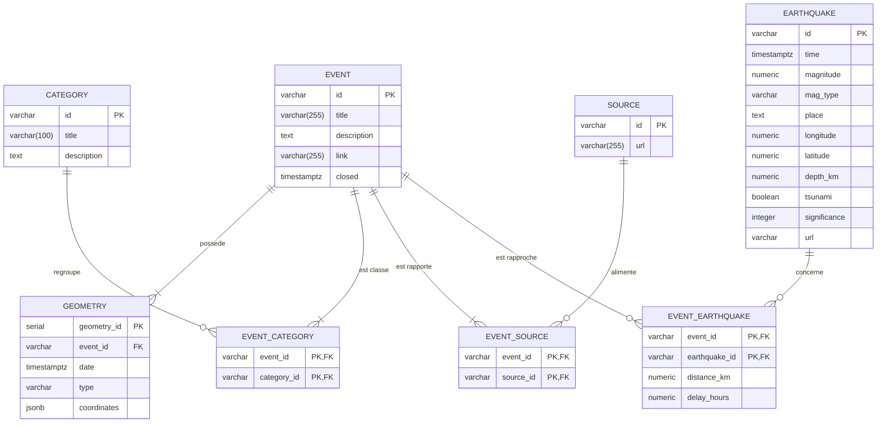

### Modèle logique (MLD)

```mermaid
erDiagram
    EVENT ||--|{ GEOMETRY : "possede"
    EVENT ||--|{ EVENT_CATEGORY : "est classe"
    CATEGORY ||--o{ EVENT_CATEGORY : "regroupe"
    EVENT ||--|{ EVENT_SOURCE : "est rapporte"
    SOURCE ||--o{ EVENT_SOURCE : "alimente"
    EVENT ||--o{ EVENT_EARTHQUAKE : "est rapproche"
    EARTHQUAKE ||--o{ EVENT_EARTHQUAKE : "concerne"

    EVENT {
        varchar id PK
        varchar(255) title
        text description
        varchar(255) link
        timestamptz closed
    }
    CATEGORY {
        varchar id PK
        varchar(100) title
        text description
    }
    SOURCE {
        varchar id PK
        varchar(255) url
    }
    GEOMETRY {
        serial geometry_id PK
        varchar event_id FK
        timestamptz date
        varchar type
        jsonb coordinates
    }
    EARTHQUAKE {
        varchar id PK
        timestamptz time
        numeric magnitude
        varchar mag_type
        text place
        numeric longitude
        numeric latitude
        numeric depth_km
        boolean tsunami
        integer significance
        varchar url
    }
    EVENT_CATEGORY {
        varchar event_id PK, FK
        varchar category_id PK, FK
    }
    EVENT_SOURCE {
        varchar event_id PK, FK
        varchar source_id PK, FK
    }
    EVENT_EARTHQUAKE {
        varchar event_id PK, FK
        varchar earthquake_id PK, FK
        numeric distance_km
        numeric delay_hours
    }
```
